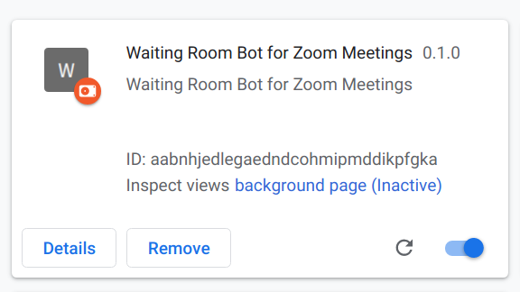
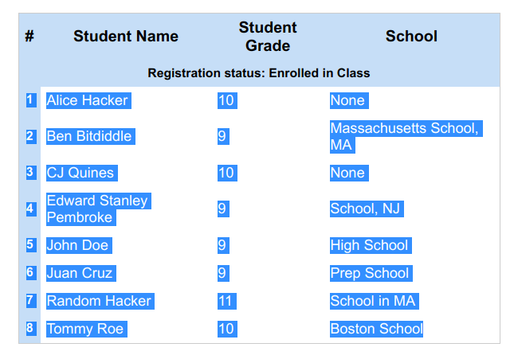
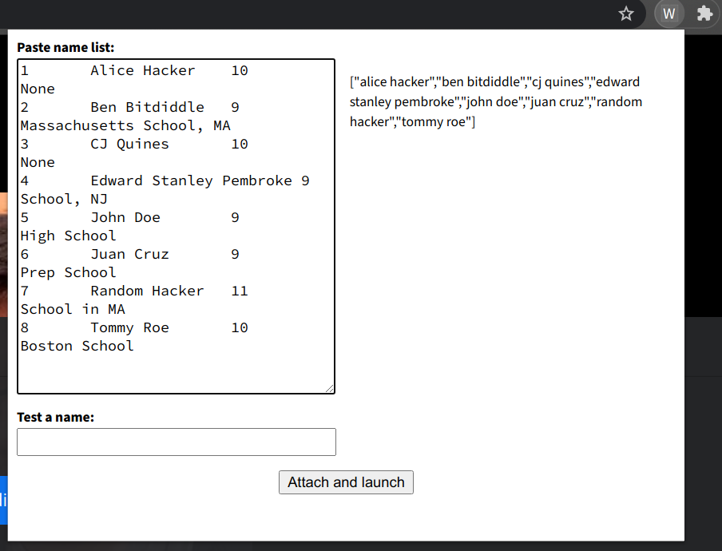

# waiting room bot

much code taken from [breakout room bot](https://github.com/HackyExtensionsForZoomMeetings/BreakoutRoomsBotForZoomMeetings)

## installation

1. [download the zip](https://github.com/cjquines/waiting-room-bot/archive/master.zip). unzip it somewhere.
2. open a new tab, type `chrome://extensions/` in the url.
3. turn developer mode on. (it's the switch in the upper-right.)
4. click load unpacked (in the top left). select the "extension" folder that you unzipped (it may be in the folder called waiting-room-bost-master folder).

if it worked, you should see "Waiting Room Bot for Zoom Meetings" be installed as a new extension:

## usage

1. join a zoom meeting using your browser. do not join with audio. make sure you become cohost.
2. copy the names from your class roster link. just select the entire table, from before the "1" on the first row to the last row:

3. click the extension in your menu bar to open the popup. it should be a button with a "W".
    * if it's not there, you might have to click the puzzle piece, and *then* click the extension.
4. paste the list of names into the big textbox. check that the names are listed.

5. click "attach and launch"

if it worked, it should send an "active!" message to the chat. do not close the chat window. use another zoom client to actually participate in the meeting.
